# Simulasi Firewall
| Nama          | NRP          |
| ------------- | ------------ |
| Irfan Qobus Salim | 5027221058 |
| Salomo Raja Exp Lane | 5027231063|

## Simulasi Firewall dengan ACL:

**Deskripsi:** Anda diminta untuk mengonfigurasi firewall di router Cisco menggunakan Access Control Lists (ACL) untuk mengontrol akses ke dan dari subnet internal.

**Tugas:**

1. Buatlah topologi jaringan sederhana di GNS3 dengan dua subnet (misalnya, 192.168.10.0/24 dan 192.168.20.0/24) yang terhubung ke router Cisco.
2. Konfigurasikan ACL di router untuk mengizinkan akses dari subnet 192.168.10.0 ke subnet 192.168.20.0 dan memblokir akses dari subnet 192.168.20.0 ke subnet 192.168.10.0.
3. Lakukan pengujian dengan melakukan ping dari host di subnet 192.168.10.0 ke host di subnet 192.168.20.0 dan sebaliknya. Dokumentasikan hasilnya.

**Jawaban:**

1. Topologi dan pengaturan VPCS
   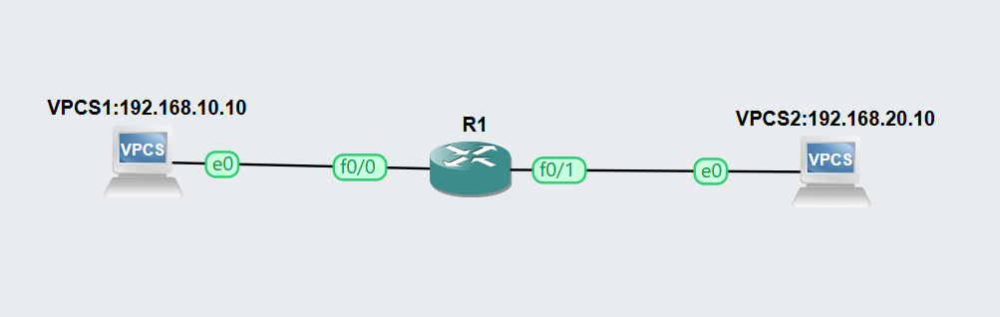
   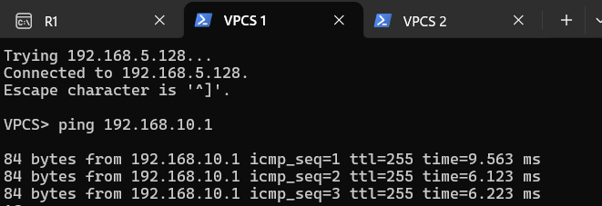
   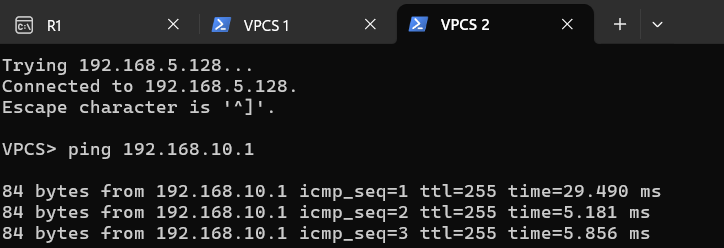

2. Melakukan konfigurasi ACL pada R1 (di sini saya menggunakan c7200)

   ```
   Router# configure terminal
   Enter configuration commands, one per line.  End with CNTL/Z.

   Router(config)#interface FastEthernet0/0
   Router(config-if)#ip address 192.168.10.1 255.255.255.0
   Router(config-if)#no shutdown
   Router(config-if)#exit
   Router(config)#
   *Oct 14 08:01:28.899: %LINK-3-UPDOWN: Interface FastEthernet0/0, changed state to up
   *Oct 14 08:01:29.899: %LINEPROTO-5-UPDOWN: Line protocol on Interface FastEthernet0/0, changed state to up

   Router(config)#interface FastEthernet0/1
   Router(config-if)#ip address 192.168.20.1 255.255.255.0
   Router(config-if)#no shutdown
   Router(config-if)#exit
   Router(config)#
   *Oct 14 08:02:16.555: %LINK-3-UPDOWN: Interface FastEthernet0/1, changed state to up
   *Oct 14 08:02:17.555: %LINEPROTO-5-UPDOWN: Line protocol on Interface FastEthernet0/1, changed state to up
   Router(config)#exit

   Router#
   *Oct 14 08:02:24.435: %SYS-5-CONFIG_I: Configured from console by console
   Router#write memory
   Building configuration...
   [OK]

   Router#show ip interface brief
   Interface              IP-Address      OK? Method Status                Protocol
   FastEthernet0/0        192.168.10.1    YES manual up                    up
   FastEthernet0/1        192.168.20.1    YES manual up                    up
   FastEthernet1/0        unassigned      YES unset  administratively down down
   FastEthernet2/0        unassigned      YES unset  administratively down down

   Router#configure terminal
   Enter configuration commands, one per line.  End with CNTL/Z.
   Router(config)#access-list 100 permit ip 192.168.10.0 0.0.0.255 192.168.20.0 0$
   Router(config)#$ 100 deny ip 192.168.20.0 0.0.0.255 192.168.10.0 0.0.0.255
   Router(config)#access-list 100 permit ip any any
   Router(config)#exit
   Router#
   *Oct 14 08:06:47.131: %SYS-5-CONFIG_I: Configured from console by console
   Router#configure terminal
   Enter configuration commands, one per line.  End with CNTL/Z.
   Router(config)#interface FastEthernet0/1
   Router(config-if)#ip access-group 100 in
   Router(config-if)#exit
   Router(config)#exit

   Router#write memory
   Building configuration...
   [OK]
   Router#show access-lists
   Extended IP access list 100
       10 permit ip 192.168.10.0 0.0.0.255 192.168.20.0 0.0.0.255
       20 deny ip 192.168.20.0 0.0.0.255 192.168.10.0 0.0.0.255 (7 matches)
       30 permit ip any any
   ```

3. Pengujian ping dari VPCS 1 ke VPCS 2 dan sebaliknya
   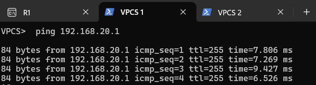
   

## Implementasi VPN Site-to-Site:
**Deskripsi:** Perusahaan Anda ingin mengamankan komunikasi antara dua kantor yang terpisah dengan VPN site-to-site menggunakan router Cisco.

**Tugas:**

1. Buatlah dua topologi jaringan di GNS3, masing-masing untuk kantor A (192.168.1.0/24) dan kantor B (192.168.2.0/24), yang terhubung melalui Internet.
2. Konfigurasikan VPN site-to-site menggunakan IPsec di router untuk mengamankan komunikasi antara kedua jaringan.
3. Lakukan pengujian dengan melakukan ping dari host di kantor A ke host di kantor B. Dokumentasikan langkah-langkah konfigurasi dan hasil pengujian.

**Jawaban:**
1. Topologi
   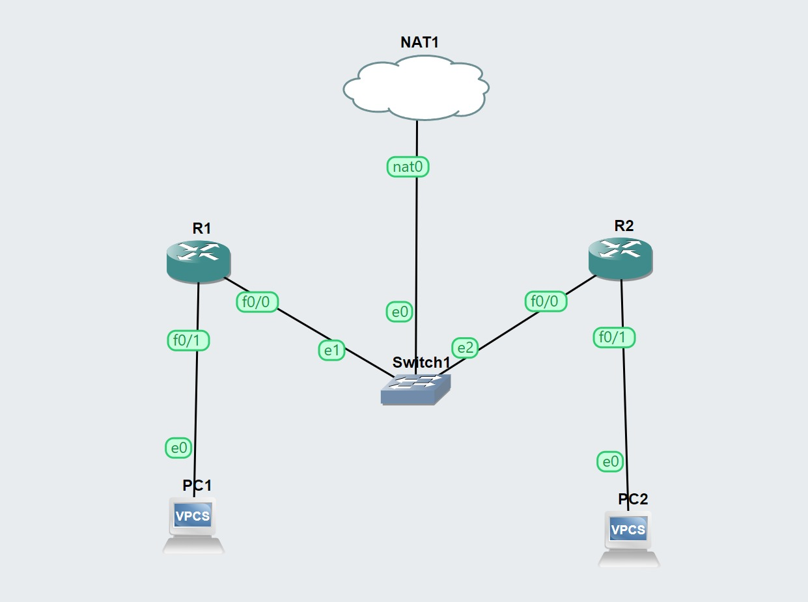

2. Kemudian saya melakukan config pada kedua router dan pc:
   Router 1:

   ```
   Router>enable
   Router#configure terminal
   Enter configuration commands, one per line.  End with CNTL/Z.
   Router(config)#
   Router(config)#interface FastEthernet0/0
   Router(config-if)#ip address 10.0.0.1 255.255.255.0
   Router(config-if)#no shutdown
   Router(config-if)#
   Router(config-if)#interface FastEthernet0/1
   Router(config-if)#ip address 192.168.1.1 255.255.255.0
   Router(config-if)#no shutdown
   Router(config-if)#
   Router(config-if)#ip route 192.168.2.0 255.255.255.0 10.0.0.2
   Router(config)#
   Router(config)#crypto isakmp policy 10
   Router(config-isakmp)# encryption aes
   Router(config-isakmp)# hash sha
   Router(config-isakmp)# authentication pre-share
   Router(config-isakmp)# group 2
   Router(config-isakmp)#exit
   Router(config)#
   Router(config)#crypto isakmp key YOUR_PRE_SHARED_KEY address 10.0.0.2
   A pre-shared key for address mask 10.0.0.2 255.255.255.255 already exists!
   Router(config)#
   Router(config)#$c transform-set MY_TRANSFORM_SET esp-aes esp-sha-hmac
   Router(cfg-crypto-trans)#crypto map MY_CRYPTO_MAP 10 ipsec-isakmp
   Router(config-crypto-map)# set peer 10.0.0.2
   Router(config-crypto-map)# set transform-set MY_TRANSFORM_SET
   Router(config-crypto-map)# match address 100
   Router(config-crypto-map)#exit
   Router(config)#
   Router(config)#$ 100 permit ip 192.168.1.0 0.0.0.255 192.168.2.0 0.0.0.255
   Router(config)#interface FastEthernet0/1
   Router(config-if)# crypto map MY_CRYPTO_MAP
   ```
   
   Router 2:
   
   ```
   Router>enable
   Router#configure terminal
   Enter configuration commands, one per line.  End with CNTL/Z.
   Router(config)#
   Router(config)#interface FastEthernet0/0
   Router(config-if)#ip address 10.0.0.2 255.255.255.0
   %Error opening tftp://255.255.255.255/ciscortr.cfg (Timed out)
   Router(config-if)#no shutdown
   Router(config-if)#
   Router(config-if)#interface FastEthernet0/1
   Router(config-if)#ip address 192.168.2.1 255.255.255.0
   Router(config-if)#no shutdown
   Router(config-if)#
   Router(config-if)#ip route 192.168.1.0 255.255.255.0 10.0.0.1
   Router(config)#
   Router(config)#crypto isakmp policy 10
   Router(config-isakmp)# encryption aes
   Router(config-isakmp)# hash sha
   Router(config-isakmp)# authentication pre-share
   Router(config-isakmp)# group 2
   Router(config-isakmp)#exit
   Router(config)#
   Router(config)#crypto isakmp key YOUR_PRE_SHARED_KEY address 10.0.0.1
   Router(config)#
   Router(config)#$c transform-set MY_TRANSFORM_SET esp-aes esp-sha-hmac
   Router(cfg-crypto-trans)#crypto map MY_CRYPTO_MAP 10 ipsec-isakmp
   Router(config-crypto-map)# set peer 10.0.0.1
   Router(config-crypto-map)# set transform-set MY_TRANSFORM_SET
   Router(config-crypto-map)# match address 100
   Router(config-crypto-map)#exit
   Router(config)#
   Router(config)#$ 100 permit ip 192.168.2.0 0.0.0.255 192.168.1.0 0.0.0.255
   Router(config)#interface FastEthernet0/1
   Router(config-if)# crypto map MY_CRYPTO_MAP
   ```

   PC1:
   ```
   PC1> ip 192.168.1.2 255.255.255.0 192.168.1.1
   Checking for duplicate address...
   PC1 : 192.168.1.2 255.255.255.0 gateway 192.168.1.1
   ```

   PC2:
   ```
   PC2> ip 192.168.2.2 255.255.255.0 192.168.2.1
   Checking for duplicate address...
   PC2 : 192.168.2.2 255.255.255.0 gateway 192.168.2.1
   ```

3. Dokumentasi :
   Router 1:
   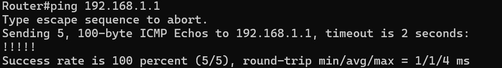
   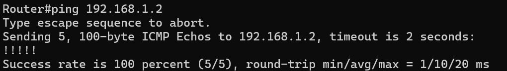
   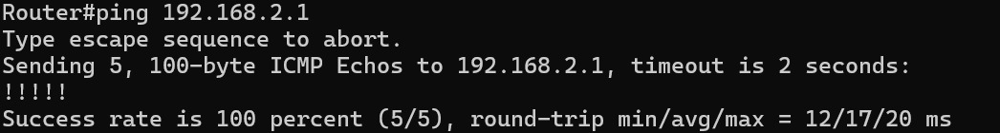
   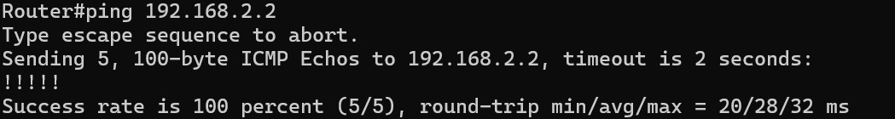

   Router 2:
   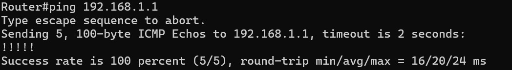
   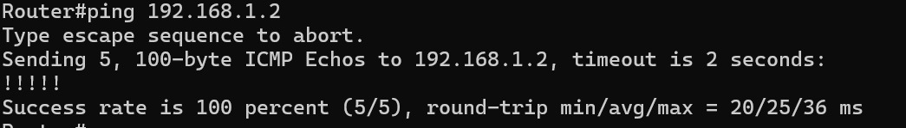
   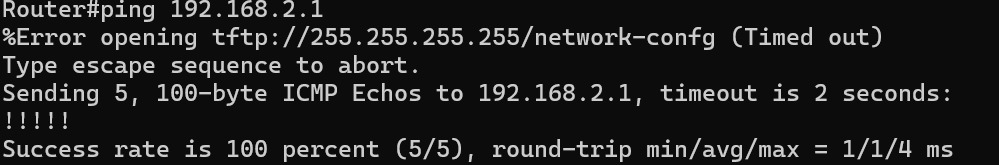
   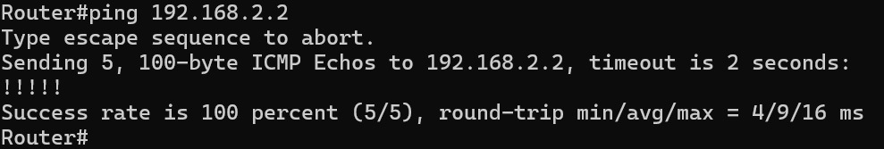
   
   
