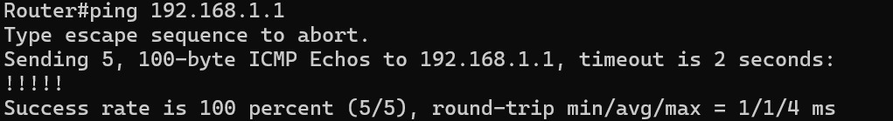
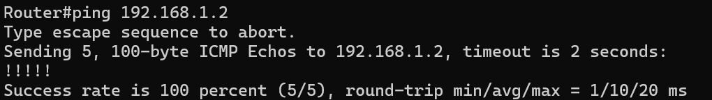
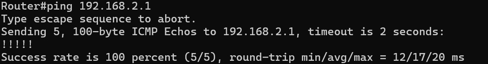
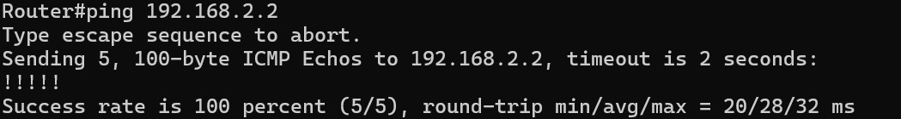
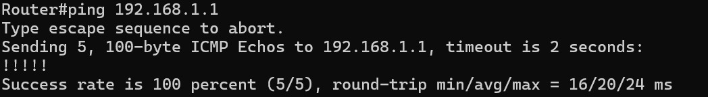
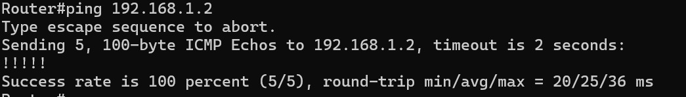
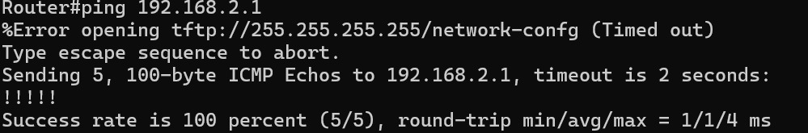
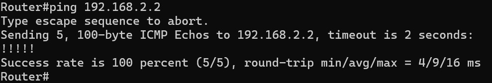

# Simulasi Firewall
| Nama          | NRP          |
| ------------- | ------------ |
| Irfan Qobus Salim | 5027221058 |
| Salomo | 5027231063|

## Simulasi Firewall dengan ACL:

**Deskripsi:** Anda diminta untuk mengonfigurasi firewall di router Cisco menggunakan Access Control Lists (ACL) untuk mengontrol akses ke dan dari subnet internal.

**Tugas:**

1. Buatlah topologi jaringan sederhana di GNS3 dengan dua subnet (misalnya, 192.168.10.0/24 dan 192.168.20.0/24) yang terhubung ke router Cisco.
2. Konfigurasikan ACL di router untuk mengizinkan akses dari subnet 192.168.10.0 ke subnet 192.168.20.0 dan memblokir akses dari subnet 192.168.20.0 ke subnet 192.168.10.0.
3. Lakukan pengujian dengan melakukan ping dari host di subnet 192.168.10.0 ke host di subnet 192.168.20.0 dan sebaliknya. Dokumentasikan hasilnya.

**Jawaban:**

1. Topologi dan pengaturan VPCS
   
   
   

2. Melakukan konfigurasi ACL pada R1 (di sini saya menggunakan c7200)

   ```
   Router# configure terminal
   Enter configuration commands, one per line.  End with CNTL/Z.

   Router(config)#interface FastEthernet0/0
   Router(config-if)#ip address 192.168.10.1 255.255.255.0
   Router(config-if)#no shutdown
   Router(config-if)#exit
   Router(config)#
   *Oct 14 08:01:28.899: %LINK-3-UPDOWN: Interface FastEthernet0/0, changed state to up
   *Oct 14 08:01:29.899: %LINEPROTO-5-UPDOWN: Line protocol on Interface FastEthernet0/0, changed state to up

   Router(config)#interface FastEthernet0/1
   Router(config-if)#ip address 192.168.20.1 255.255.255.0
   Router(config-if)#no shutdown
   Router(config-if)#exit
   Router(config)#
   *Oct 14 08:02:16.555: %LINK-3-UPDOWN: Interface FastEthernet0/1, changed state to up
   *Oct 14 08:02:17.555: %LINEPROTO-5-UPDOWN: Line protocol on Interface FastEthernet0/1, changed state to up
   Router(config)#exit

   Router#
   *Oct 14 08:02:24.435: %SYS-5-CONFIG_I: Configured from console by console
   Router#write memory
   Building configuration...
   [OK]

   Router#show ip interface brief
   Interface              IP-Address      OK? Method Status                Protocol
   FastEthernet0/0        192.168.10.1    YES manual up                    up
   FastEthernet0/1        192.168.20.1    YES manual up                    up
   FastEthernet1/0        unassigned      YES unset  administratively down down
   FastEthernet2/0        unassigned      YES unset  administratively down down

   Router#configure terminal
   Enter configuration commands, one per line.  End with CNTL/Z.
   Router(config)#access-list 100 permit ip 192.168.10.0 0.0.0.255 192.168.20.0 0$
   Router(config)#$ 100 deny ip 192.168.20.0 0.0.0.255 192.168.10.0 0.0.0.255
   Router(config)#access-list 100 permit ip any any
   Router(config)#exit
   Router#
   *Oct 14 08:06:47.131: %SYS-5-CONFIG_I: Configured from console by console
   Router#configure terminal
   Enter configuration commands, one per line.  End with CNTL/Z.
   Router(config)#interface FastEthernet0/1
   Router(config-if)#ip access-group 100 in
   Router(config-if)#exit
   Router(config)#exit

   Router#write memory
   Building configuration...
   [OK]
   Router#show access-lists
   Extended IP access list 100
       10 permit ip 192.168.10.0 0.0.0.255 192.168.20.0 0.0.0.255
       20 deny ip 192.168.20.0 0.0.0.255 192.168.10.0 0.0.0.255 (7 matches)
       30 permit ip any any
   ```

3. Pengujian ping dari VPCS 1 ke VPCS 2 dan sebaliknya
   
   

## Implementasi VPN Site-to-Site:
**Deskripsi:** Perusahaan Anda ingin mengamankan komunikasi antara dua kantor yang terpisah dengan VPN site-to-site menggunakan router Cisco.

**Tugas:**

1. Buatlah dua topologi jaringan di GNS3, masing-masing untuk kantor A (192.168.1.0/24) dan kantor B (192.168.2.0/24), yang terhubung melalui Internet.
2. Konfigurasikan VPN site-to-site menggunakan IPsec di router untuk mengamankan komunikasi antara kedua jaringan.
3. Lakukan pengujian dengan melakukan ping dari host di kantor A ke host di kantor B. Dokumentasikan langkah-langkah konfigurasi dan hasil pengujian.

**Jawaban:**
1. Topologi
   

2. Kemudian saya melakukan config pada kedua router dan pc:
   Router 1:

   ```
   Router>enable
   Router#configure terminal
   Enter configuration commands, one per line.  End with CNTL/Z.
   Router(config)#
   Router(config)#interface FastEthernet0/0
   Router(config-if)#ip address 10.0.0.1 255.255.255.0
   Router(config-if)#no shutdown
   Router(config-if)#
   Router(config-if)#interface FastEthernet0/1
   Router(config-if)#ip address 192.168.1.1 255.255.255.0
   Router(config-if)#no shutdown
   Router(config-if)#
   Router(config-if)#ip route 192.168.2.0 255.255.255.0 10.0.0.2
   Router(config)#
   Router(config)#crypto isakmp policy 10
   Router(config-isakmp)# encryption aes
   Router(config-isakmp)# hash sha
   Router(config-isakmp)# authentication pre-share
   Router(config-isakmp)# group 2
   Router(config-isakmp)#exit
   Router(config)#
   Router(config)#crypto isakmp key YOUR_PRE_SHARED_KEY address 10.0.0.2
   A pre-shared key for address mask 10.0.0.2 255.255.255.255 already exists!
   Router(config)#
   Router(config)#$c transform-set MY_TRANSFORM_SET esp-aes esp-sha-hmac
   Router(cfg-crypto-trans)#crypto map MY_CRYPTO_MAP 10 ipsec-isakmp
   Router(config-crypto-map)# set peer 10.0.0.2
   Router(config-crypto-map)# set transform-set MY_TRANSFORM_SET
   Router(config-crypto-map)# match address 100
   Router(config-crypto-map)#exit
   Router(config)#
   Router(config)#$ 100 permit ip 192.168.1.0 0.0.0.255 192.168.2.0 0.0.0.255
   Router(config)#interface FastEthernet0/1
   Router(config-if)# crypto map MY_CRYPTO_MAP
   ```
   
   Router 2:
   
   ```
   Router>enable
   Router#configure terminal
   Enter configuration commands, one per line.  End with CNTL/Z.
   Router(config)#
   Router(config)#interface FastEthernet0/0
   Router(config-if)#ip address 10.0.0.2 255.255.255.0
   %Error opening tftp://255.255.255.255/ciscortr.cfg (Timed out)
   Router(config-if)#no shutdown
   Router(config-if)#
   Router(config-if)#interface FastEthernet0/1
   Router(config-if)#ip address 192.168.2.1 255.255.255.0
   Router(config-if)#no shutdown
   Router(config-if)#
   Router(config-if)#ip route 192.168.1.0 255.255.255.0 10.0.0.1
   Router(config)#
   Router(config)#crypto isakmp policy 10
   Router(config-isakmp)# encryption aes
   Router(config-isakmp)# hash sha
   Router(config-isakmp)# authentication pre-share
   Router(config-isakmp)# group 2
   Router(config-isakmp)#exit
   Router(config)#
   Router(config)#crypto isakmp key YOUR_PRE_SHARED_KEY address 10.0.0.1
   Router(config)#
   Router(config)#$c transform-set MY_TRANSFORM_SET esp-aes esp-sha-hmac
   Router(cfg-crypto-trans)#crypto map MY_CRYPTO_MAP 10 ipsec-isakmp
   Router(config-crypto-map)# set peer 10.0.0.1
   Router(config-crypto-map)# set transform-set MY_TRANSFORM_SET
   Router(config-crypto-map)# match address 100
   Router(config-crypto-map)#exit
   Router(config)#
   Router(config)#$ 100 permit ip 192.168.2.0 0.0.0.255 192.168.1.0 0.0.0.255
   Router(config)#interface FastEthernet0/1
   Router(config-if)# crypto map MY_CRYPTO_MAP
   ```

   PC1:
   ```
   PC1> ip 192.168.1.2 255.255.255.0 192.168.1.1
   Checking for duplicate address...
   PC1 : 192.168.1.2 255.255.255.0 gateway 192.168.1.1
   ```

   PC2:
   ```
   PC2> ip 192.168.2.2 255.255.255.0 192.168.2.1
   Checking for duplicate address...
   PC2 : 192.168.2.2 255.255.255.0 gateway 192.168.2.1
   ```

3. Dokumentasi :

   Router 1:
   
   
   
   

   Router 2:
   
   
   
   

## Analisis Lalu Lintas Jaringan dengan Wireshark:

**Deskripsi:** Anda diminta untuk menganalisis lalu lintas jaringan di GNS3 untuk mengidentifikasi potensi masalah keamanan.

**Tugas:**
1. Buatlah topologi jaringan dengan router Cisco dan beberapa host di GNS3.
2. Konfigurasikan router untuk menerapkan ACL yang memblokir akses ke port tertentu (misalnya, port 80 untuk HTTP).
3. Jalankan Wireshark di salah satu host untuk menangkap paket yang ditransmisikan.
4. Coba akses situs web (HTTP) dari host yang diblokir dan catat hasilnya. Apa yang dapat Anda simpulkan tentang efektivitas firewall dalam mencegah akses ke layanan tertentu?

**Jawaban**
1. Topologi
   

2. Konfigurasi router untuk menerapkan ACL
   ```
   R6#conf terminal
   Enter configuration commands, one per line.  End with CNTL/Z.
   R6(config)#interface FastEthernet0/0
   R6(config-if)#ip address 192.168.10.1 255.255.255.0
   R6(config-if)#no shutdown
   R6(config-if)#e
   *Oct 16 22:45:10.447: %LINK-3-UPDOWN: Interface FastEthernet0/0, changed state to up
   *Oct 16 22:45:11.447: %LINEPROTO-5-UPDOWN: Line protocol on Interface FastEthernet0/0, changed state to up
   R6(config-if)#exit
   R6(config)#interface FastEthernet1/0
   R6(config-if)#ip address 192.168.20.1 255.255.255.0
   R6(config-if)#no shutdown
   R6(config-if)#exi
   *Oct 16 22:50:11.315: %LINK-3-UPDOWN: Interface FastEthernet1/0, changed state to up
   *Oct 16 22:50:12.315: %LINEPROTO-5-UPDOWN: Line protocol on Interface FastEthernet1/0, changed state to up
   R6(config-if)#exit
   R6(config)#exit
   *Oct 16 22:50:23.815: %SYS-5-CONFIG_I: Configured from console by console
   R6#show ip int brief
   Interface              IP-Address      OK? Method Status                Protocol
   FastEthernet0/0        192.168.10.1    YES manual up                    up
   FastEthernet0/1        unassigned      YES unset  administratively down down
   FastEthernet1/0        192.168.20.1    YES manual up                    up
   FastEthernet2/0        unassigned      YES unset  administratively down down
   R6#conf terminal
   Enter configuration commands, one per line.  End with CNTL/Z.
   R6(config)#access-list 101 deny tcp any any eq 80
   R6(config)#access-list 100 permit ip any any
   R6(config)#int FastEthernet0/0
   R6(config-if)#ip access-group 101 in
   R6(config)#int FastEthernet1/0
   R6(config-if)#ip access-group 101 in
   ```

3. Wireshark menangkap jaringan
   

4. Kesimpulan:

## Penerapan QoS dan Pemantauan Kinerja:
**Deskripsi:** Perusahaan Anda ingin memastikan bahwa aplikasi penting mendapatkan bandwidth yang cukup melalui penerapan QoS (Quality of Service).

**Tugas:**

1. Buatlah topologi jaringan di GNS3 dengan beberapa host dan router Cisco.
2. Konfigurasikan kebijakan QoS untuk memberikan prioritas tinggi pada lalu lintas dari subnet tertentu (misalnya, subnet 192.168.1.0/24).
3. Gunakan alat pengujian lalu lintas (misalnya, iPerf) untuk mensimulasikan lalu lintas dari subnet yang berbeda.
4. Dokumentasikan pengaruh QoS terhadap kinerja lalu lintas yang diuji. Apakah ada perbedaan yang signifikan dalam bandwidth yang dialokasikan?

**Jawaban:**
1. Topologi
   

2. Kemudian saya melakukan config pada router sebagai berikut:
   ```
   Router>enable
   Router#configure terminal
   Enter configuration commands, one per line.  End with CNTL/Z.
   Router(config)#interface f0/0
   Router(config-if)#ip address 192.168.1.1 255.255.255.0
   Router(config-if)#no shutdown
   Router(config-if)#
   Router(config-if)#interface f1/0
   Router(config-if)#ip address 192.168.2.1 255.255.255.0
   Router(config-if)#no shutdown
   Router(config-if)#
   Router(config-if)#access-list 10 permit 192.168.1.0 0.0.0.255
   Router(config)#class-map match-any HIGH-PRIO
   Router(config-cmap)#match access-group 10
   Router(config-cmap)#exit
   Router(config)#
   Router(config)#policy-map QOS-POLICY
   Router(config-pmap)#class HIGH-PRIO
   Router(config-pmap-c)#priority 1000
   Router(config-pmap-c)#exit
   Router(config-pmap)#class class-default
   Router(config-pmap-c)#fair-queue
   Router(config-pmap-c)#exit
   Router(config-pmap)#
   Router(config-pmap)#interface f1/0
   Router(config-if)#service-policy output QOS-POLICY
   Router(config-if)#
   *Oct 16 15:26:57.931: %LINK-3-UPDOWN: Interface FastEthernet0/0, changed state to up
   *Oct 16 15:26:57.995: %LINK-3-UPDOWN: Interface FastEthernet1/0, changed state to up
   *Oct 16 15:26:58.931: %LINEPROTO-5-UPDOWN: Line protocol on Interface FastEthernet0/0, changed state to up
   *Oct 16 15:26:58.995: %LINEPROTO-5-UPDOWN: Line protocol on Interface FastEthernet1/0, changed state to up
   ```
3. Kemudian saya bagi jadi 2 percobaan:
   Percobaan 1:
   ```
   Host 1: iperf3 -s
   Host 2: iperf3 -c 192.168.1.2 -u -b 10M
   ```

   Percobaan 2:
   ```
   Host 1: iperf3 -c 192.168.2.2 -u -b 10M
   Host 2: iperf3 -s
   ```

4. Dokumentasi Hasil Percobaan:

    
    
   

5. Kesimpulan

   **Jitter:**
   Host 1 memiliki jitter yang awalnya kecil, namun meningkat tajam seiring dengan kenaikan bandwidth.
   Host 2 memiliki jitter yang relatif lebih besar di awal, namun stabil di nilai yang lebih rendah untuk sebagian besar interval.

   **Packet Loss:**
   Host 1 menunjukkan packet loss yang lebih tinggi pada bandwidth besar, terutama setelah transfer data meningkat di interval ke-10.
   Host 2 memiliki packet loss yang sangat besar pada awal pengujian dan tetap konsisten tinggi sepanjang pengujian.

   **Bandwidth:**
   Host 1 menunjukkan bandwidth yang rendah pada awal dan kemudian meningkat tajam.
   Host 2 memiliki bandwidth yang lebih tinggi dan lebih stabil, namun kehilangan datagram yang tinggi mengindikasikan masalah besar pada pengiriman data.

## Simulasi Serangan dan Penanggulangan:

**Deskripsi:** Anda ingin menguji ketahanan jaringan Anda terhadap serangan umum, seperti serangan DDoS, dengan menggunakan GNS3.

**Tugas:**
1. Buatlah topologi jaringan dengan router Cisco dan beberapa host di GNS3.
2. Konfigurasikan firewall untuk mengizinkan akses normal tetapi membatasi jumlah koneksi yang dapat dibuat dari satu alamat IP dalam satu waktu.
3. Gunakan alat simulasi serangan (misalnya, Hping3) untuk melakukan serangan DDoS pada salah satu host di jaringan.
4. Amati bagaimana firewall menangani serangan tersebut dan catat hasilnya. Apa yang bisa Anda lakukan untuk meningkatkan pertahanan jaringan terhadap serangan DDoS?
